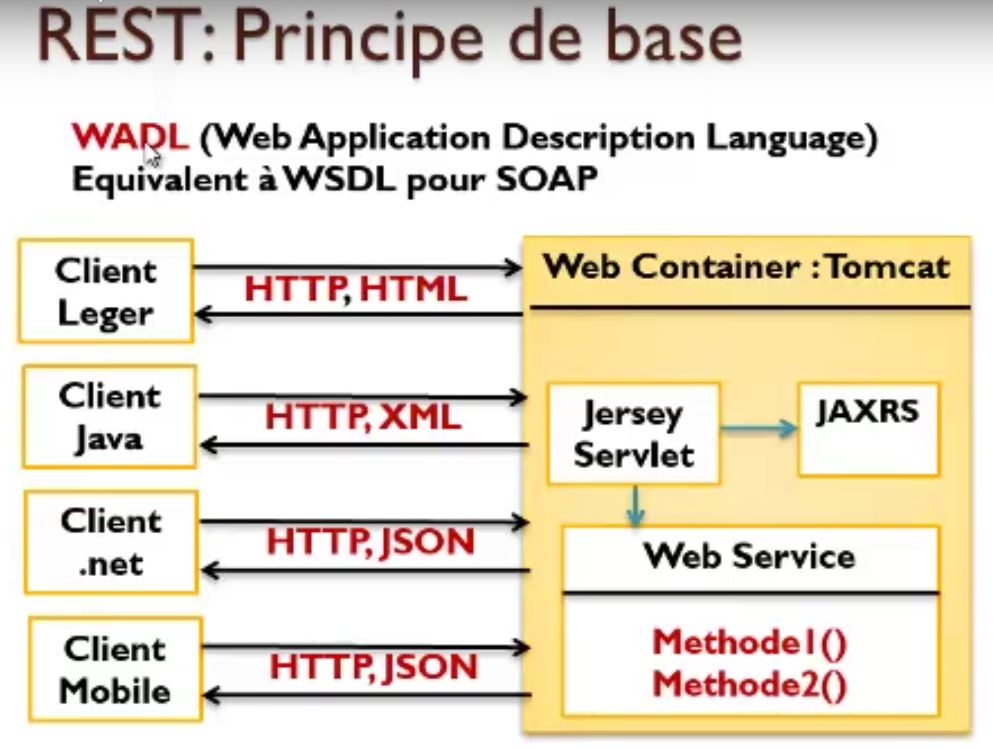
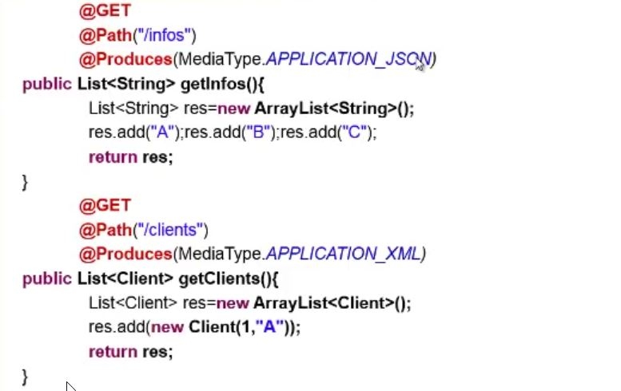

# RestFul

**JERSEY** est un framework open-source écrit en langage Java permettant de développer des services web selon l'architecture REST suivant les spécifications de **JAX-RS**. **JERSEY** est une servlet ( server web )

**WADL (Web Application Description Language)** 
**WADL** est un document XML qui définit un vocable permettant de décrire les applications web. WADL a pour but d'être pour REST le pendant des fichiers **WSDL** pour **SOAP**. **Jersey** génère automatiquement un document **WADL** qui inclut les ressources de la racine ainsi que le maximum de métadonnées, qui sont extraites des classes via les annotations de **JAX-RS2**. 

**JACKSON** est une **API** qui permet de faire le mapping **object** to **json** et inversement.
**JAXB** est une **API** qui permet de faire le mapping **object** to **xml** et inversement.

**JAX-RS : la spécification**
-  **Différentes implémentations de la spécification JAX-RS sont disponibles**
    - **JERSEY** : implémentation de référence fournie par Oracle Site projet : http://jersey.java.net
    - **CXF** : fournie par Apache, la fusion entre XFire etCeltix Site projet : cxf.apache.org
    - **RESTEasy** : fournie par JBoss Site projet :www.jboss.org/resteasy
    - **RESTlet** : un des premiers framework implémentant REST pour Java : Site projet : www.restlet.org

## Mise en oeuvre
[mise en oeuvre d'un webService REST ](doc/webServicesRESTFULSever.md)

