# RESTFUL server

[Exemple: 1 jersey jax-rs implementation exemple avec Dynamic Web Project et maven ](https://crunchify.com/how-to-build-restful-service-with-java-using-jax-rs-and-jersey/)

[Exemple: 2 jersey jax-rs implementation exemple avec Dynamic Web Project et maven](https://www.journaldev.com/498/jersey-java-tutorial)

**Il est préférable de creer un Dynamic Web Project puis de le convertir en un projet maven pour laisser maven le soin d'importer les jar nécessaire qu'au lieu de le gerer soit même.**


Les annotations de **jackson** pour la gestion des données sous forme mediaType **json** reconnaissent aussi les annotatoins de **jaxb** ( qui manipule les mediaType **xml** ). Ainsi **@xmlTranscient** de **jaxb** sera reconnu par **jackson**.  On peut donc aussi utiliser l'annotation jaxb **@XmlTransient** ou l'annotation **jackson** **@JsonIgnore** directement 


Les annotations **jaxb** pour le **xml** reconnait aussi les annotations **jackson** pour le json

# Creation et conversion du projet

Creation d'un projet web dynamic et le convertir en un projet maven


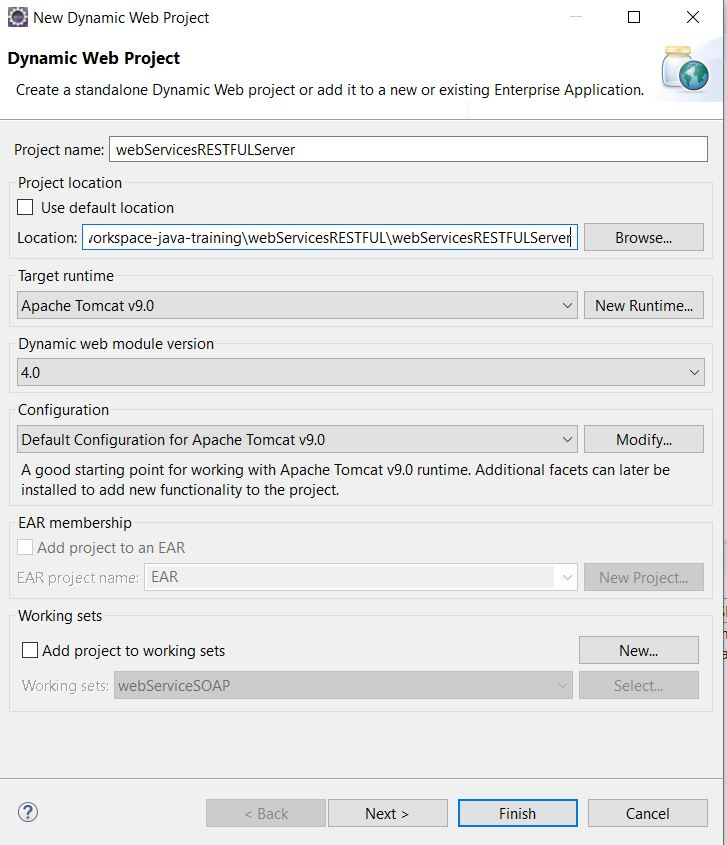

Convertir le projet en un projet maven. Ceci rendra plus facilement la gestion automatisée des jar.

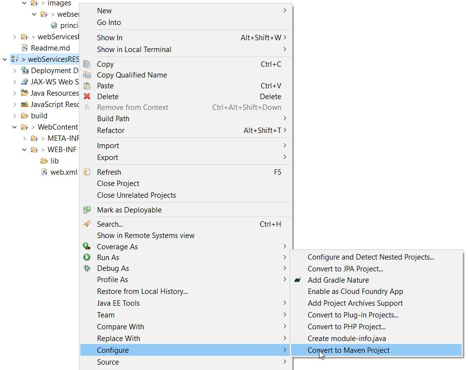

Configuration tomcat

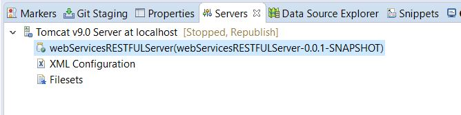


configurer **tomcat** pour hoster l'application.


## Ajouter la section suivante au fichier web.xml


La section init-param  <param-name>com.sun.jersey.config.property.packages</param-name> indique où se trouve les services à exposer. Tous les services doivent donc se trouver dans le package java indiqué ( ici pour exemple c'est **service** )


Si l'on souhaite manipuler un content Type Json **@MediaType.APPLICATION_JSON** il faudra alors prévoir d'ajouter la section  **<param-name>com.sun.jersey.api.json.POJOMappingFeature</param-name>**  et d'ajouter la section **jersey-json** Dependency dans le fichier maven.

Si l'on souhaite manipuler un content Type xml **	MediaType.APPLICATION_XML** il faudra alors d'annoter toutes les entités avec **@XmlRootElement**


Au démarrage tomcat va lire le fichier **web.xml** et rechercher les webservices dans le package spécifiés ( ici pour exemple **service** ou sont stockés nos services) 


```xml
<?xml version="1.0" encoding="UTF-8"?>
<web-app xmlns:xsi="http://www.w3.org/2001/XMLSchema-instance"
	xmlns="http://xmlns.jcp.org/xml/ns/javaee"
	xsi:schemaLocation="http://xmlns.jcp.org/xml/ns/javaee http://xmlns.jcp.org/xml/ns/javaee/web-app_4_0.xsd"
	id="WebApp_ID" version="4.0">
	<display-name>webServicesRESTFULServer</display-name>
	<welcome-file-list>
		<welcome-file>index.html</welcome-file>
		<welcome-file>index.htm</welcome-file>
		<welcome-file>index.jsp</welcome-file>
		<welcome-file>default.html</welcome-file>
		<welcome-file>default.htm</welcome-file>
		<welcome-file>default.jsp</welcome-file>
	</welcome-file-list>


	<!--Jersey Servlet configurations -->
	<servlet>
		<servlet-name>Jersey REST Service</servlet-name>
		<servlet-class>com.sun.jersey.spi.container.servlet.ServletContainer</servlet-class>
		<init-param>
			<param-name>com.sun.jersey.config.property.packages</param-name>
			<param-value>service</param-value>
		</init-param>
		<init-param>
			<param-name>com.sun.jersey.api.json.POJOMappingFeature</param-name>
			<param-value>true</param-value>
		</init-param>
		<load-on-startup>1</load-on-startup>
	</servlet>
	<servlet-mapping>
		<servlet-name>Jersey REST Service</servlet-name>
		<url-pattern>/*</url-pattern>
	</servlet-mapping>
	<!--Jersey Servlet configurations -->


</web-app>
```

## Creation d'un Service Restful

Creer une classe et la stockée dans le package java **service** conformément au fichier **web.xml**. On peut bien entendu changer le package , il faudra alors le faire aussi dans le fichier **web.xml**

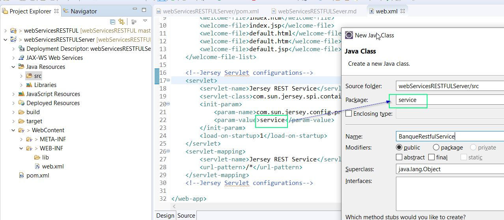

Au démarrage, **tomcat** va lire le fichier **web.xml** et rechercher les webservices dans le package spécifiés ( ici pour exemple service ou sont stockés nos services) 


```java
package service;

import java.util.ArrayList;
import java.util.Date;
import java.util.HashMap;
import java.util.List;
import java.util.Map;

import javax.ws.rs.Consumes;
import javax.ws.rs.DELETE;
import javax.ws.rs.GET;
import javax.ws.rs.POST;
import javax.ws.rs.PUT;
import javax.ws.rs.Path;
import javax.ws.rs.PathParam;
import javax.ws.rs.Produces;
import javax.ws.rs.core.MediaType;

import metier.Compte;

@Path("/banque")
public class BanqueRestfulService {

	// Simule une base de données.
	private static Map<Integer, Compte> comptes = new HashMap<Integer, Compte>();

	@GET
	@Path("/conversion/{montant}")
	@Produces(MediaType.APPLICATION_JSON)   //add MediaType.APPLICATION_XML if you want XML as well (don't forget @XmlRootElement in entity)
	@Consumes(MediaType.APPLICATION_JSON) //add MediaType.APPLICATION_XML if you want XML as well (don't forget @XmlRootElement in entity)
	public double conversion (@PathParam("montant") double montant) {
		return montant * 11 ; 
	}
	
	@GET
	@Path("/comptes/{code}")
	@Produces(MediaType.APPLICATION_JSON) //add MediaType.APPLICATION_XML if you want XML as well (don't forget @XmlRootElement in entity)
	public Compte getCompte ( @PathParam("code") int code) {
		//return new Compte(code, Math.random()*67000, new Date());
		return comptes.get(code) ; 
	}
	
	@GET
	@Path("/comptes")
	@Produces({MediaType.APPLICATION_JSON, MediaType.APPLICATION_XML})
	public List<Compte> listComptes() {
		return new ArrayList<Compte>(comptes.values()) ; 
	}
	
	@POST
	@Path("/comptes")
	@Produces({MediaType.APPLICATION_JSON, MediaType.APPLICATION_XML})
	public Compte save (Compte compte ) {
		/*
		 compte in body =>
		   {
            "code": 1,
             "solde": 10000
          } 
	   */
		compte.setDateCreation(new Date());
		comptes.put(compte.getCode(), compte);
		return compte;
	}

	@PUT
	@Path("/comptes/{code}")
	@Produces({MediaType.APPLICATION_JSON, MediaType.APPLICATION_XML})
	public Compte miseAjours (Compte compte,@PathParam("code")int code ) {
		/*
		 compte in body =>
		   {
             "code": 1,
              "solde": 10000
           } 
	*/
		comptes.put(code, compte);
		return compte;
	}
	
	@DELETE
	@Path("/comptes/{code}")
	@Produces({MediaType.APPLICATION_JSON, MediaType.APPLICATION_XML})
	public boolean delete (@PathParam("code")int code ) {
		comptes.remove(code);
		return true;
	}
	
}

```


## Entités


l'annotation **jackon** ( pour le json ) dans les **entités** java ( ici Compte ) renconnait l'annotation JAXB (xml). On pourrait enlever cette annotation.

```java
package metier;

import java.io.Serializable;
import java.util.Date;

import javax.xml.bind.annotation.XmlRootElement;
import javax.xml.bind.annotation.XmlTransient;

import org.codehaus.jackson.annotate.JsonIgnore;

@XmlRootElement  // l'annotation jackon ( json ) renconnait l'annotation JAXB (xml). On pourrait enlever cette annotation.
public class Compte implements Serializable {

	private int code;
	private double solde;
	private Date dateCreation;

	public Compte() {
		super();
	}

	public Compte(int code, double solde, Date dateCreation) {
		super();
		this.code = code;
		this.solde = solde;
		this.dateCreation = dateCreation;
	}

	public int getCode() {
		return code;
	}

	public void setCode(int code) {
		this.code = code;
	}

	public double getSolde() {
		return solde;
	}

	public void setSolde(double solde) {
		this.solde = solde;
	}

	// @JsonIgnore // Not return dataCreation attribute ( jackson annotation )
	@XmlTransient // Not return dataCreation attribute ( jaxb annotation  )
	public Date getDateCreation() {
		return dateCreation;
	}

	public void setDateCreation(Date dateCreation) {
		this.dateCreation = dateCreation;
	}
}
```


## MediaType

l'attribut **Accept** dans le header permet de signifier au serveur distant que l'on voudrait recevoir les données sous un format particulier , xml, jason, text ....
On peut demander à **postman** quel sera le format du retour accepté **Accept** et le format d'envoi **media-content**.
  

Recevoir au format xml et envoyer au format json

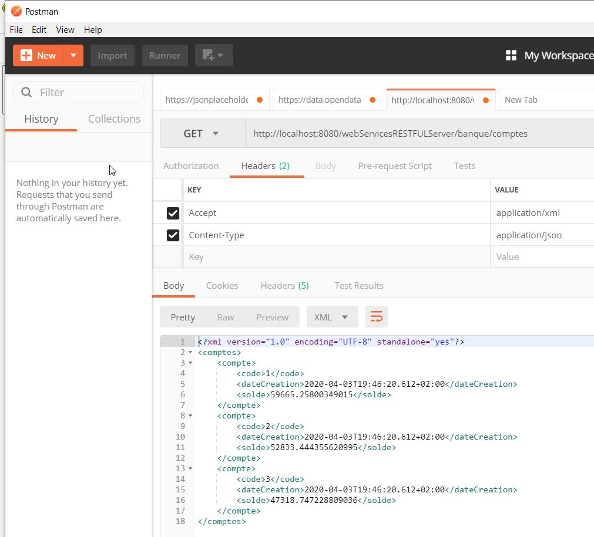


Recevoir au format json et envoyer au format json

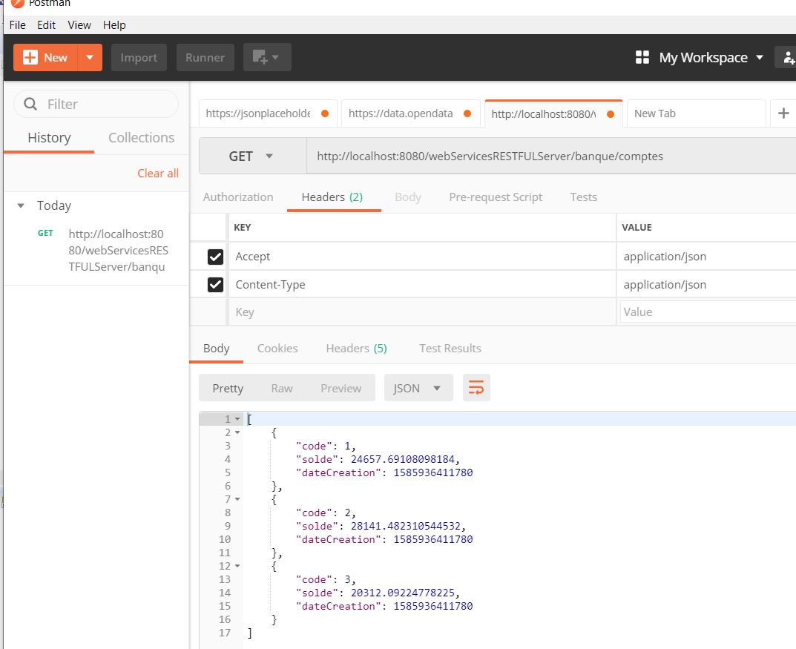


## methodes

### GET One element
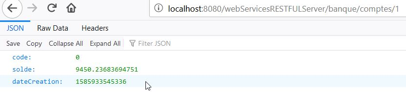

### GET All elements

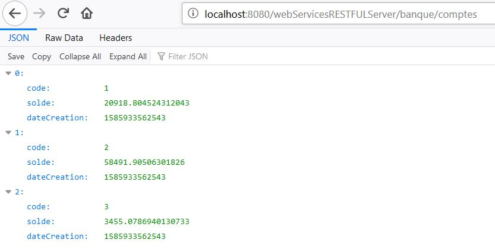

### POST ( Création d'un Compte)

### PUT ( Mise à jours d'un Compte)
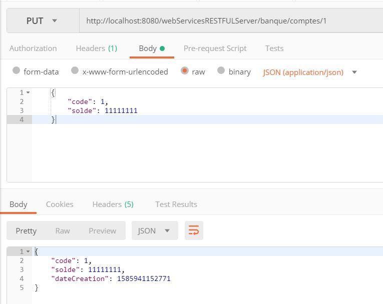

### DELETE ( Suppresion d'un Compte)

## WADL

### Apercu du service RESTful 

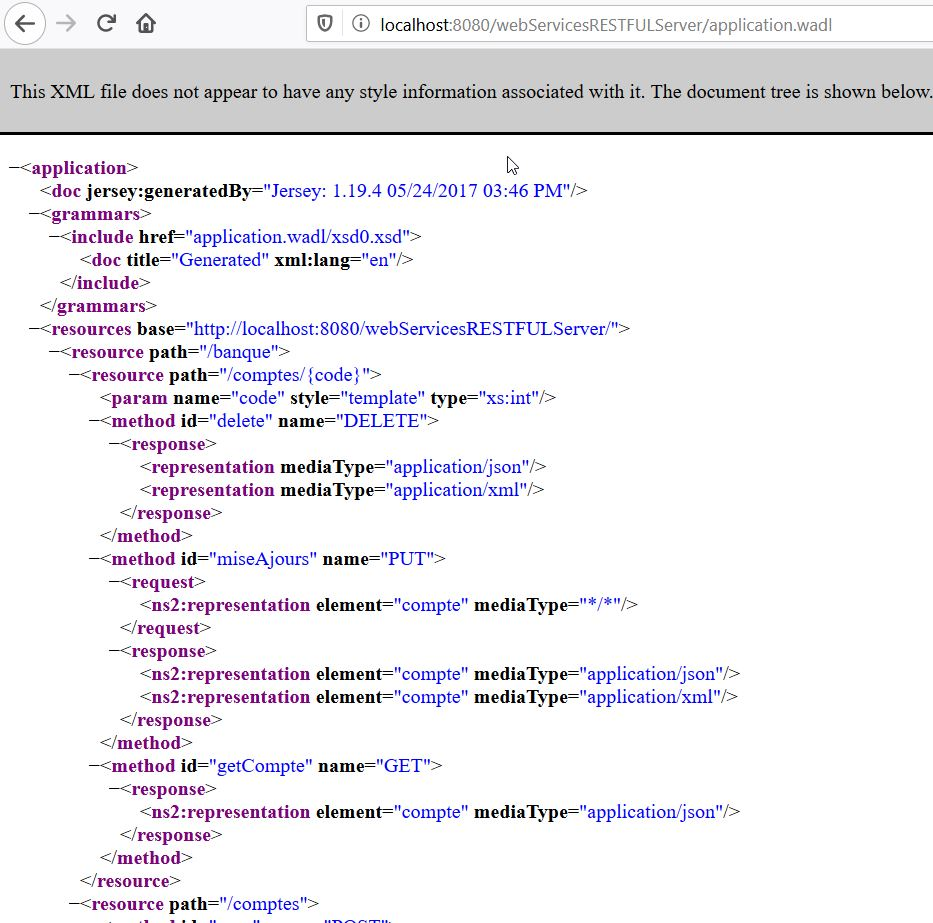


### Apercu de l'entité "Compte"
On accepte à l'entité par 
La premier entité est accessible par  **xsd0**, la second par **xsd1**  etc ...


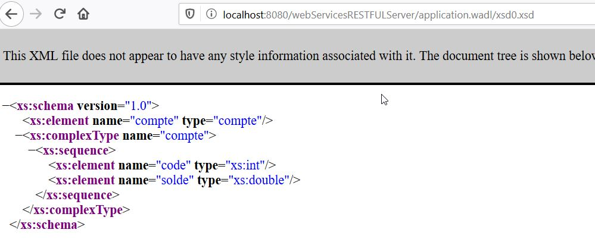
